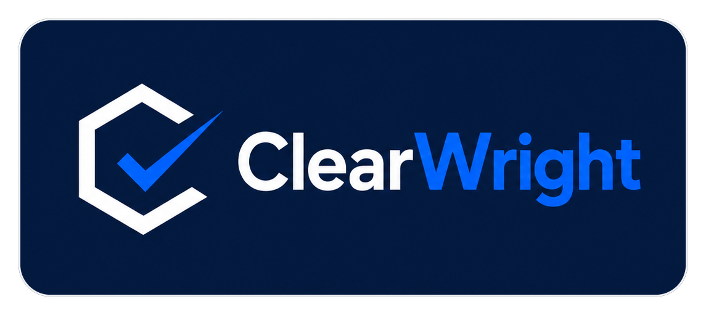

# ClearWright&trade;



ClearWright is an operator-controlled clearance, review, and audit layer
for multi-AI-agent work. Agents request clearance before they occupy the next
workflow channel, check readiness before starting expensive work, and act within
operator-defined authority classes. Independent review supports clearance; it
does not grant authority. The operator remains the highest authority and final override,
and every request leaves a durable record.

Operator-controlled means the operator defines policy, authority classes, and
escalation rules, not that the operator approves every routine action. Agents may
clear and deny routine actions within their delegated authority.

The specification is the **ClearWright Protocol**: Request to Act (RTA), Clear to
Act (CTA), Denied to Act (DTA), Request for Information (RFI), and durable
**clearance packets** that move through a four-state **clearance queue**.

> **Status: early local alpha.** ClearWright is a local reference implementation
> of the ClearWright Protocol, human-commanded and operator-controlled, and under
> active development. It is in daily governed use by its operator - including
> governing this repository's own development through an automated real GPT +
> Codex Review Council that dispatches over a fail-closed egress guard. It is
> single-operator and local: not multi-user, not publicly deployable, and not
> production-ready.
> Strategic plan: [PROJECT_PLAN.md](PROJECT_PLAN.md) · public summary:
> [ROADMAP.md](ROADMAP.md) · decisions: [docs/DECISIONS.md](docs/DECISIONS.md).

## ClearWright Protocol: Human Authority for AI-Assisted Work

The core idea is simple and strict:

- AI may prepare plans and perform work inside an approved scope.
- Independent reviewers may challenge those plans.
- Only an explicit, durable human authorization releases the next step.
- The system stays fail-closed. Absence of clearance is treated as denial.
- Every decision, including the authorization itself, is written to a durable, append-only audit record.

ClearWright today is a local, single-operator, early-alpha proof of concept that implements and
exercises these mechanisms locally for governed workflows: a clearance queue, a durable operator
console and an append-only audit record, an automated review council that runs real independent review
by two separate AI models through a fail-closed egress guard, and fail-closed gates and verification
before completion. Planning for its first self-improvement capability is complete and has passed a
two-reviewer plan gate; no implementation authority has been granted and no such code exists yet. Beyond
that governed two-model review lane, review and advising for this work have also been exercised through
ChatGPT (API and WebUI), Codex, Claude, and Grok Pro WebUI. Grok currently participates via the WebUI as
an out-of-band production advisor; full API integration into the governed review lane is pending. The
clearance, review, and audit pattern is the core idea; the local implementation is an evolving proof of
concept.

Full description: [docs/CLEARWRIGHT_PROTOCOL_PUBLIC.md](docs/CLEARWRIGHT_PROTOCOL_PUBLIC.md).

## Why ClearWright

Capable agents still need coordination. Without a clearance layer, agents start
work against stale assumptions, collide with one another, duplicate effort, spend
tokens on avoidable work, and generate noisy review loops. ClearWright gives an
agent a way to request, grant, deny, defer, or escalate an action before it takes
the next step.

The design principles are simple:

- Human authority stays central. AI accelerates the work; it does not replace
  judgment.
- The point of automation is to reduce friction and error, not to remove the
  operator from the loop.
- Every important decision leaves a record that can be inspected later.
- High-value work is handled locally first, where it can be controlled.
- Unbounded agent autonomy creates risk and noise, so authority is bounded and
  ordered.

## Core model in plain English

- An agent files an **RTA** (request to act) as a clearance packet.
- A reviewer or orchestrator issues a **CTA** (cleared) or **DTA** (denied), or
  asks for more information with an **RFI**. A DTA is a successful governance
  outcome, not a failure.
- A cleared packet is **claimed** into the in-progress lane, worked, then marked
  **DONE**, or **FAILED** if execution actually broke.
- Authority is ordered like a chain of command with domain lanes. `0001` is the
  highest normal human command; `0000` is reserved for an emergency root halt
  only. Escalation climbs only as far as it must.

See [docs/CLEARWRIGHT_PROTOCOL.md](docs/CLEARWRIGHT_PROTOCOL.md) for the protocol,
[docs/AUTHORITY_MODEL.md](docs/AUTHORITY_MODEL.md) for the authority model,
[docs/QUEUE_MODEL.md](docs/QUEUE_MODEL.md) for the clearance queue,
[docs/LOCAL_REPO_PROFILE.md](docs/LOCAL_REPO_PROFILE.md) for the enforceable local
profile, [docs/GLOSSARY.md](docs/GLOSSARY.md) for terms, and
[docs/NAMING.md](docs/NAMING.md) for the naming rules.

## What exists today

This repository ships the local, single-machine foundation:

- A clearance packet schema and JSON example ([schema/](schema/)).
- A packet validator with optional strict queue-path checks
  (`tools/clearwright_validate.py`).
- A single-packet claim tool that moves a packet from the outbox to in-progress
  (`tools/clearwright_claim.py`).
- A manual lifecycle tool: inspect, complete (optionally with nested completion
  results), fail, stale detection, and status (`tools/clearwright_lifecycle.py`).
- A manual clearance decision tool: clear (CTA), deny (DTA), or request
  information (RFI) on one outbox packet (`tools/clearwright_decide.py`).
- A manual RTA intake tool: author one new request into the outbox
  (`tools/clearwright_request.py`).
- A local agent event adapter: record agent events into the durable queue over
  CLI or local HTTP (`tools/clearwright_agent_event.py`).
- A local communications loop: post, list, and respond to durable, threaded,
  packet-linked messages over CLI or local HTTP (`tools/clearwright_message.py`,
  `/api/messages`), so agents and tools converse with ClearWright without a
  browser.
- A live dispatch loop: derived work items agents can list, claim, and respond
  to over CLI or local HTTP (`tools/clearwright_work.py`, `/api/work-items`), an
  operator chat in the console, a live-polling UI with a pulsing workflow graph,
  and a read-only History view.
- A worker command bridge (`tools/clearwright_worker.py`: `next`, `claim`,
  `progress`, `respond`, `status`) and a runbook that make "use CW" a real,
  repeatable worker behavior over CLI or local HTTP, no browser required. Worker
  HTTP routes (`/api/work-items/claim|progress|respond`) share the CLI guard and
  reject unknown work items.
- A telemetry-backed Codex review helper (`tools/clearwright_codex_review.py`)
  and a one-command proof flow (`tools/clearwright_proof.py`). Both take an
  absolute `--repo` path (and the proof tool a `--server-url` preflight) so they
  run from any directory without `cd` or chained shell.
- A focused Active Run view (`/api/active-run`, selectable by `?thread_id=`)
  with a run registry (`/api/runs`, one derived summary per durable message
  thread) so the operator can browse and review recent runs; copy buttons and
  Codex telemetry as fields.
- A read-only system health endpoint (`/api/health`: green/yellow/red readiness
  with counts, capabilities, and plain-language warnings) and a compact health
  chip in the console.
- An archive-aware durable record (old completed packets collapse behind a
  Show-completed toggle; files never touched) and a pulse inspector that
  explains why the workflow graph is pulsing and when it stops.
- A Conversation Workspace (`/api/conversations`) where operator/agent dialogue
  happens on the durable threads: thread list, readable timeline, composer with
  thread continuation, and escalation to work items or clearance packets when a
  conversation turns into governed work.
- A chat/work separation so normal conversation stays quiet: a message can carry
  an `intent` (`chat` is plain conversation, `request` is actionable; under the
  v2 closed origin rule a new message derives a work item ONLY with an explicit
  `request` intent -- omitted means conversation, while pre-cutover records keep
  the historical omitted-means-actionable convention via the frozen legacy
  manifest). Chat messages are durable but never derive a work item and never
  turn the health chip yellow; the composer defaults to Message and only
  Ask agent / Create work item / Request clearance make a message actionable.
- An automated **Review Council** (`tools/clearwright_review_council.py`) that
  coordinates real GPT (OpenAI Responses API, `tools/clearwright_gpt_review.py`)
  and real Codex (structured mode of the telemetry-backed CLI helper)
  independent reviews of a plan, records each round durably under
  `review_councils/`, and decides with a deterministic agreement rule over
  structured verdicts (never prose). `OPENAI_API_KEY` is read only from the
  environment and never stored; reviewers are never faked; council agreement
  never grants authority. Read-only `GET /api/review-councils` /
  `GET /api/review-council` and a Conversation Workspace council card. See
  [docs/REVIEW_COUNCIL.md](docs/REVIEW_COUNCIL.md).
- An executable **Use CW** skill (`tools/clearwright_use_cw.py` +
  `.claude/skills/use-cw/SKILL.md`, installed by `tools/install_use_cw_skill.py`)
  that turns "Use CW to do X" into an automatic governed loop over the Review
  Council (start / plan / council / progress / incident / verify / complete /
  status) with compact JSON and stable exit codes. Council agreement never grants
  authority; the operator's approved scope does. See [docs/USE_CW.md](docs/USE_CW.md).
- A **fail-closed egress guard** (Sensitive Data Egress Guard) on the
  review-council dispatch path (`tools/clearwright_egress_guard.py`): every real
  GPT and Codex request is bound to committed, tracked, approved-repository
  sources, verified byte-for-byte against a canonical form at send, and scanned
  for sensitive-data and unicode-confusable tripwires, with provider credentials
  resolved only inside the guard and never exposed to adapters. Governed
  self-review of ClearWright's own control-plane code runs in a dedicated
  **internal_technical (ITS)** dispatch lane, and dispatch eligibility is proven
  before any council id or reviewer attempt is spent.
- **Fail-closed plan gates**: a plan or incident council that escalates to the
  operator creates a durable gate; the governed workflow refuses to proceed
  until a durable, post-gate operator authority message resolves it.
- **Fail-closed verification**: completion refuses DONE unless the bound
  verification council reached agreement; operator-only closure requires its
  own durable, post-outcome authority record.
- **Review profiles** (`code` / `editorial`) with prompt-only reviewer lanes
  that never touch the deterministic agreement rule.
- **Message payload integrity**: canonical content, size caps, thread-scoped
  idempotency, and strict HTTP framing on the local API.
- **Artifact and evidence handling**: pinned artifacts with full-hash
  provenance, delivered capability-aware to each reviewer.
- A **durable archive layer**: journaled, crash-safe moves of old terminal
  records under a hash-bound operator approval (no server write route),
  forward-only recovery, archive-aware reads, and an execution runbook. See
  [docs/ARCHIVE_OPERATION.md](docs/ARCHIVE_OPERATION.md).
- A **task-centered operator site**: three-region desktop (work queue, selected
  task with a six-phase stepper, operator panel), a unified filterable History
  ledger across packets/messages/events with archived-record labeling.
- A stdlib test suite ([tests/](tests/)) and a CI naming/confidentiality gate.

Evidence convention: capability claims in the planning documents are labeled
**[repo-verifiable]** (merged PRs, committed tests, CI) or
**[operator-attested]** (demonstrated on the operator's live local system,
backed by dated durable local records, not independently verifiable from this
repository). See [PROJECT_PLAN.md](PROJECT_PLAN.md) section 3.

Documented as direction, not yet implemented here: a read-only packet index, a
canonical packet hash policy, and a unified operator command surface. These are
planned steps, described honestly as future work.

## Quickstart

```sh
# Validate the example clearance packet
python tools/clearwright_validate.py schema/examples/clearance_packet.example.json

# Report queue health across a clearance queue root (read-only)
python tools/clearwright_lifecycle.py status examples/queue/

# Inspect one packet (read-only)
python tools/clearwright_lifecycle.py inspect \
    examples/queue/clearance_in_progress/<packet>.json

# Clear an outbox packet to act (stays in the outbox until claimed)
python tools/clearwright_decide.py cta \
    examples/queue/clearance_outbox/<packet>.json --actor OPERATOR-0001

# Deny an outbox packet (a governance outcome; moves to clearance_done/)
python tools/clearwright_decide.py dta \
    examples/queue/clearance_outbox/<packet>.json \
    --actor OPERATOR-0001 --reason "Out of scope for this milestone."

# Request more information (stays in the outbox for follow-up)
python tools/clearwright_decide.py rfi \
    examples/queue/clearance_outbox/<packet>.json \
    --actor OPERATOR-0001 --reason "Which files does this change?"
```

Runtime clearance packets are local data and are not committed to the repository.
The paths above are illustrative.

## What ClearWright is and is not

ClearWright is the authorization, consensus, and audit layer for agent work: who
may act, whether the channel is clear, what clearance was granted, who can
override, when work should defer or escalate, and what the layer prevented. It is
not a tool-access framework, an agent-to-agent messaging bus, or a workflow
orchestrator. It sits above and beside those.

It is early alpha and a local reference implementation. It is not production-ready,
not an official standard, and not a compliance framework. Consensus may support a
clearance, but it does not grant authority; the operator remains the final
override.

## Naming

The product and platform is ClearWright. The specification is the ClearWright
Protocol. The record artifact is a clearance packet. See
[docs/NAMING.md](docs/NAMING.md) for the full naming rules.

## Key Terminology

The core protocol acronyms are CW (ClearWright), RTA (Request to Act), CTA (Clear to
Act), DTA (Denied to Act), and RFI (Request for Information). By convention, acronyms
are expanded on first meaningful use in substantial documents. See
[docs/GLOSSARY.md](docs/GLOSSARY.md) for the full glossary and acronym list.

## Peer review welcome

ClearWright is public as an early alpha so the protocol, queue lifecycle,
authority model, and local reference implementation can be reviewed in the open.
Reviews that challenge lifecycle correctness, authority boundaries, audit
behavior, and implementation simplicity are especially useful. See
[docs/PEER_REVIEW.md](docs/PEER_REVIEW.md).

## Project docs

- [PROJECT_PLAN.md](PROJECT_PLAN.md): the strategic source of truth - current
  verified state with evidence, phases, dependencies, acceptance criteria,
  risk register, metrics, and the public/private information boundary.
- [ROADMAP.md](ROADMAP.md): the concise public summary - current status, next,
  later, and non-goals.
- [docs/DECISIONS.md](docs/DECISIONS.md): the public-safe decision register.
- [docs/END_OF_ALPHA_TARGET.md](docs/END_OF_ALPHA_TARGET.md): end-of-alpha target
  workflow (protocol vision, not a current-state implementation claim).
- [docs/PEER_REVIEW.md](docs/PEER_REVIEW.md): what review is useful and how to
  offer it.
- [docs/CONTROL_PLANE_DEMO.md](docs/CONTROL_PLANE_DEMO.md): the local control
  plane console tour (the operator display).
- [docs/OPERATOR_MODE.md](docs/OPERATOR_MODE.md): operator mode (live local use)
  vs demo mode for the local control plane, and how agents and tools drive it.
- [docs/LOCAL_COMMUNICATIONS.md](docs/LOCAL_COMMUNICATIONS.md): the local
  communications and dispatch loop (CLI and local HTTP messages, threads, packet
  links, work items).
- [docs/WORKER_RUNBOOK.md](docs/WORKER_RUNBOOK.md): what a worker (Claude, Codex,
  or a script) should do when the operator says "use CW".
- [CHANGELOG.md](CHANGELOG.md): notable changes.
- [CONTRIBUTING.md](CONTRIBUTING.md): how to contribute.
- [CODE_OF_CONDUCT.md](CODE_OF_CONDUCT.md): community expectations.
- [SECURITY.md](SECURITY.md): how to report security issues.
- [TRADEMARK.md](TRADEMARK.md): trademark policy.

## License

Licensed under the Apache License, Version 2.0. See [LICENSE](LICENSE). The
Apache-2.0 license does not grant rights to the ClearWright name or marks; see
[TRADEMARK.md](TRADEMARK.md).

---

Built by Shawn C. Tovey, RCDD / LimitedEnergyX.

ClearWright&trade; is a trademark of Shawn C. Tovey, RCDD. U.S. trademark
application Serial No. 99912120 is pending; registration is not claimed.
