# ClearWright End-of-Alpha Target State: Human Command to Final Output

> **This is a protocol-vision target state for end of alpha.** It describes
> intended accountability boundaries and workflow behavior. Automated,
> independent multi-model review already ships and is in daily governed use;
> what this diagram adds on top is a specific end-to-end packet-lane
> integration that is not a claim that every step shown is wired together
> today. For what the public alpha actually ships, see
> [Current alpha implementation boundary](#current-alpha-implementation-boundary)
> below.

This document shows the intended end-of-alpha accountability flow: how a human
command becomes a proposed action, how that action is validated, reviewed,
cleared or denied, executed within a bounded lease, reviewed again, and finally
dispositioned, with every step recorded to an audit trail. It uses only the
ClearWright Protocol's defined packet statuses and the four physical clearance
queue lanes.

## Legend

- **Human Operator**: command authority, final disposition, emergency halt.
- **Claude Orchestrator**: planning, coordination, integration, and approved
  tool use.
- **GPT Review Manager**: challenge, review, safety, clarity, and public-posture
  review.
- **Codex Code Worker**: bounded code, test, or example drafting.
- **ClearWright tools**: validate, decide, claim, and lifecycle controls.
- **Desktop Commander and Chrome**: tools used by Claude, not independent
  authorities.
- **GitHub**: witness log for branches, commits, PRs, CI, and merge history.
- **Consensus**: may support a decision but does not grant authority.

The named multi-agent roles above (GPT Review Manager, Codex Code Worker, and
the consensus loop) describe intended operating behavior for this specific
packet-lane flow. ClearWright already ships an automated Review Council that
runs real, independent GPT and Codex review of a plan under a deterministic
agreement rule, through a fail-closed egress guard, and it is in daily governed
use. What remains roadmap in this diagram is the end-to-end packet-lane
integration shown here, not the existence of automated multi-model review.

## Packet statuses and lanes

The workflow uses only these nine statuses, each living in one of four physical
queue lanes:

| Lane | Statuses |
| --- | --- |
| `clearance_outbox` | `RTA`, `IN_REVIEW`, `RFI_PENDING`, `CTA` (pre-claim) |
| `clearance_in_progress` | `IN_PROGRESS` |
| `clearance_done` | `DONE`, `DTA`, `SUPERSEDED` (closed outcomes) |
| `clearance_failed` | `FAILED` (execution failure after a claim) |

`DTA` is a successful governance outcome, not a failure. `SUPERSEDED` is a closed
replacement, not a failure. An operator halt or freeze is an operator action, not
a packet status.

## Target workflow

```mermaid
%%{init: {"flowchart": {"htmlLabels": true, "nodeSpacing": 70, "rankSpacing": 85, "curve": "basis"}}}%%
graph TD

    %% Classes
    classDef groupTitle fill:transparent,stroke:transparent,color:#ffffff;
    classDef human fill:#2b3a4a,stroke:#38bdf8,stroke-width:2px,color:#ffffff;
    classDef claude fill:#172554,stroke:#60a5fa,stroke-width:2px,color:#eff6ff;
    classDef gpt fill:#312e81,stroke:#a78bfa,stroke-width:2px,color:#f5f3ff;
    classDef codex fill:#0f3f3f,stroke:#2dd4bf,stroke-width:2px,color:#ecfeff;
    classDef tool fill:#111827,stroke:#94a3b8,stroke-width:1px,color:#e5e7eb;
    classDef github fill:#18181b,stroke:#d4d4d8,stroke-width:1px,color:#fafafa;
    classDef packet fill:#0f172a,stroke:#38bdf8,stroke-width:2px,color:#f8fafc;
    classDef queue fill:#1e1b4b,stroke:#818cf8,stroke-width:2px,color:#e0e7ff;
    classDef success fill:#064e3b,stroke:#34d399,stroke-width:2px,color:#ecfdf5;
    classDef denied fill:#4c0519,stroke:#f43f5e,stroke-width:2px,color:#fff1f2;
    classDef pending fill:#7c2d12,stroke:#fb923c,stroke-width:2px,color:#fff7ed;
    classDef closed fill:#334155,stroke:#cbd5e1,stroke-width:2px,color:#f8fafc;
    classDef audit fill:#172554,stroke:#60a5fa,stroke-width:2px,color:#eff6ff;
    classDef loop fill:#3b0764,stroke:#c084fc,stroke-width:2px,color:#faf5ff;

    subgraph Human_Command[" "]
        HC_TITLE["<b><big>1. Human Command</big></b>"]:::groupTitle
        H1["HUMAN OPERATOR<br/>States goal, constraints, priority<br/>Creates command intent"]:::human
        H2["HUMAN OPERATOR<br/>Sets authority boundary<br/>OPERATOR-0001 normal command<br/>0000 emergency halt only"]:::human
        H3["HUMAN OPERATOR<br/>Defines acceptance criteria<br/>What final output must prove"]:::human
    end

    subgraph Claude_Orchestration[" "]
        CO_TITLE["<b><big>2. Claude Orchestrator</big></b>"]:::groupTitle
        C1["CLAUDE ORCHESTRATOR<br/>Interprets human request<br/>Frames task and assumptions"]:::claude
        C2["CLAUDE ORCHESTRATOR<br/>Prepares work plan<br/>Scope, risks, steps, verify plan"]:::claude
        C3["CLAUDE ORCHESTRATOR<br/>Creates RTA packet<br/>Request to Act"]:::claude
        P1["CLEARANCE PACKET<br/>RTA<br/>Proposed action record"]:::packet
    end

    subgraph ClearWright_Intake[" "]
        CI_TITLE["<b><big>3. ClearWright Intake</big></b>"]:::groupTitle
        V1["CLEARWRIGHT VALIDATOR<br/>Checks packet<br/>Schema, status, required fields,<br/>naming rules"]:::tool
        Q1["CLEARANCE QUEUE<br/>clearance_outbox<br/>Valid RTA awaiting review"]:::queue
        X1["INVALID PACKET<br/>Rejected for correction<br/>No execution failure"]:::denied
    end

    subgraph Review_Challenge[" "]
        RC_TITLE["<b><big>4. Review and Challenge</big></b><br/><i>Roadmap: not fully automated in current alpha</i>"]:::groupTitle
        IR1["CLEARANCE QUEUE<br/>IN_REVIEW<br/>Packet under review in outbox"]:::queue
        G1["GPT REVIEW MANAGER<br/>Challenges plan<br/>Scope, safety, public posture,<br/>authority, assumptions"]:::gpt
        G2["GPT REVIEW MANAGER<br/>Returns review result<br/>No blocking objection,<br/>objection, or RFI recommendation"]:::gpt
        C4["CLAUDE ORCHESTRATOR<br/>Responds to review<br/>Accepts pushback or revises plan"]:::claude
    end

    subgraph Clearance_Decision[" "]
        CD_TITLE["<b><big>5. Clearance Decision</big></b>"]:::groupTitle
        D1["HUMAN OR DELEGATED AUTHORITY<br/>Issues decision<br/>Consensus may inform,<br/>but does not authorize"]:::human
        CTA["CLEARWRIGHT DECISION TOOL<br/>CTA<br/>Bounded clearance lease<br/>clearance_outbox until claimed"]:::success
        DTA["CLEARWRIGHT DECISION TOOL<br/>DTA<br/>Terminal governance denial<br/>clearance_done"]:::denied
        RFI["CLEARWRIGHT DECISION TOOL<br/>RFI_PENDING<br/>Decision-time clarification<br/>stays in clearance_outbox"]:::pending
    end

    subgraph Bounded_Execution[" "]
        BE_TITLE["<b><big>6. Bounded Execution</big></b>"]:::groupTitle
        LEASE["CTA LEASE CHECK<br/>Scope, expiry, revocation,<br/>narrowing, escalation"]:::tool
        CL1["CLAUDE ORCHESTRATOR<br/>Claims approved work<br/>Only after CTA"]:::claude
        CT1["CLEARWRIGHT CLAIM TOOL<br/>Moves packet to clearance_in_progress<br/>Status becomes IN_PROGRESS"]:::tool
        CX1["CODEX CODE WORKER<br/>Receives bounded task<br/>Drafts code, tests, or examples"]:::codex
        CX2["CODEX CODE WORKER<br/>Returns patch or recommendation<br/>No authority to merge or publish"]:::codex
        C5["CLAUDE ORCHESTRATOR<br/>Reviews Codex output<br/>Integrates only inside CTA scope"]:::claude
    end

    subgraph Tool_Surface[" "]
        TS_TITLE["<b><big>7. Tool Surface and Witness Log</big></b><br/><i>Roadmap: not fully automated in current alpha</i>"]:::groupTitle
        DC1["DESKTOP COMMANDER<br/>Tool used by Claude<br/>Local files, shell, editor actions"]:::tool
        CH1["CHROME<br/>Tool used by Claude<br/>GitHub UI and browser tasks"]:::tool
        GH1["GITHUB<br/>Witness log<br/>Branches, commits, PRs, CI, merge history"]:::github
    end

    subgraph Engineering_Loop[" "]
        EL_TITLE["<b><big>8. Engineering Review Loop, Max 5</big></b><br/><i>Roadmap: not fully automated in current alpha</i>"]:::groupTitle
        L0["LOOP CONTROLLER<br/>Maximum 5 engineering loops<br/>Stop if blocked, unclear, or out of scope"]:::loop
        L1["CLAUDE ORCHESTRATOR<br/>Runs checks<br/>Tests, diff review, naming gate,<br/>scope check"]:::claude
        L2["GPT REVIEW MANAGER<br/>Reviews integrated result<br/>Pushes back on logic, safety,<br/>clarity, or authority risk"]:::gpt
        L3["CLAUDE ORCHESTRATOR<br/>Routes bounded update<br/>To Codex if code change is needed"]:::claude
        L4["CODEX CODE WORKER<br/>Updates patch<br/>Returns revised code or test changes"]:::codex
        LEASE2["MID-EXECUTION CTA LEASE CHECK<br/>Re-checks lease before consensus<br/>Scope, expiry, revocation"]:::tool
        L5["CONSENSUS THRESHOLD CHECK<br/>No unresolved blocking objection<br/>Validation passes<br/>Still inside CTA scope"]:::loop
        ESC["ESCALATION / CTA REVIEW<br/>Blocked, stale, expired, revoked,<br/>or outside approved scope"]:::pending
    end

    subgraph Output_Review[" "]
        OR_TITLE["<b><big>9. Output and Final Review</big></b>"]:::groupTitle
        O1["CLAUDE ORCHESTRATOR<br/>Prepares final output package<br/>Artifact, PR, report, evidence,<br/>known limits"]:::claude
        G3["GPT REVIEW MANAGER<br/>Final review<br/>Checks clarity, safety, scope,<br/>and public posture"]:::gpt
        H4["HUMAN OPERATOR<br/>Final disposition<br/>Approve, reject, revise,<br/>merge, publish, or halt"]:::human
        DONE["DONE<br/>Accepted output<br/>clearance_done"]:::success
        FAILED["FAILED<br/>Execution failed after clearance<br/>clearance_failed"]:::denied
        SUPERSEDED["SUPERSEDED<br/>Replaced by newer packet<br/>clearance_done"]:::closed
    end

    subgraph Global_Control[" "]
        GC_TITLE["<b><big>10. Global Operator Control</big></b>"]:::groupTitle
        HALT["OPERATOR HALT / FREEZE ACTION<br/>Emergency stop or freeze<br/>Not a packet status"]:::denied
    end

    subgraph Audit_Record[" "]
        AR_TITLE["<b><big>11. Audit Record</big></b>"]:::groupTitle
        AUDIT["CLEARWRIGHT AUDIT RECORD<br/>Captures command, RTA, validation,<br/>CTA/DTA/RFI, claims, agent reviews,<br/>tool use, CI, output, halt/freeze,<br/>and final disposition"]:::audit
    end

    %% Main flow
    H1 --> H2 --> H3 --> C1
    C1 --> C2 --> C3 --> P1
    P1 --> V1

    V1 -->|valid| Q1
    V1 -->|invalid| X1
    X1 -->|correct and resubmit| C2

    Q1 -->|begin review| IR1
    IR1 --> G1 --> G2 --> C4 --> D1

    D1 -->|clear| CTA
    D1 -->|deny| DTA
    D1 -->|need more info| RFI

    RFI -->|answer from human| H1
    RFI -->|revise plan| C1

    CTA --> LEASE
    LEASE -->|valid lease| CL1
    LEASE -->|expired, revoked, narrowed, or escalated| ESC

    CL1 --> CT1 --> CX1 --> CX2 --> C5

    CL1 --> DC1
    CL1 --> CH1
    CH1 --> GH1

    C5 --> L0 --> L1 --> L2
    L2 -->|no blocking objection| LEASE2
    L2 -->|blocking objection| L3 --> L4 --> C5

    LEASE2 -->|lease valid, in scope| L5
    LEASE2 -->|expired, revoked, or out of scope| ESC

    L5 -->|threshold met| O1
    L5 -->|blocked after max loops| ESC
    L5 -->|outside CTA scope| ESC

    ESC -->|rollback to outbox for decision| D1
    ESC -->|replacement required| SUPERSEDED
    ESC -->|new scope required| C2

    O1 --> G3
    G3 -->|clear final review| H4
    G3 -->|blocking concern before final disposition| ESC

    H4 -->|approved| DONE
    H4 -->|revise under new scope| C2
    H4 -->|replace with newer packet| SUPERSEDED

    SUPERSEDED -->|replacement starts fresh RTA cycle| C2

    %% Execution failure path
    CT1 -->|claim or execution error| FAILED
    C5 -->|execution failure| FAILED
    L1 -->|test failure not resolved| FAILED

    %% Emergency halt, global interrupt
    H2 -.emergency halt can interrupt any stage.-> HALT
    C1 -.interrupted by halt.-> HALT
    Q1 -.interrupted by halt.-> HALT
    CT1 -.interrupted by halt.-> HALT
    O1 -.interrupted by halt.-> HALT

    %% Audit, phase-level records
    H3 -.records.-> AUDIT
    P1 -.records.-> AUDIT
    V1 -.records.-> AUDIT
    IR1 -.records.-> AUDIT
    D1 -.records.-> AUDIT
    CTA -.records.-> AUDIT
    DTA -.records.-> AUDIT
    RFI -.records.-> AUDIT
    LEASE -.records.-> AUDIT
    LEASE2 -.records.-> AUDIT
    CT1 -.records.-> AUDIT
    GH1 -.records.-> AUDIT
    L5 -.records.-> AUDIT
    ESC -.records.-> AUDIT
    H4 -.records.-> AUDIT
    DONE -.records.-> AUDIT
    FAILED -.records.-> AUDIT
    SUPERSEDED -.records.-> AUDIT
    HALT -.records.-> AUDIT
```

## Reading the diagram

- **Statuses only ever move between their defined lanes.** A packet is `RTA`,
  `IN_REVIEW`, `RFI_PENDING`, or `CTA` while in `clearance_outbox`; becomes
  `IN_PROGRESS` when claimed into `clearance_in_progress`; and ends as `DONE`,
  `DTA`, or `SUPERSEDED` in `clearance_done`, or `FAILED` in `clearance_failed`.
- **`DTA` is terminal and is not connected to `DONE`.** Denial is a governance
  outcome recorded in `clearance_done`, distinct from accepted output.
- **`RFI_PENDING` is only a decision-time clarification path.** It loops back to
  the human or orchestrator before a decision, and stays in `clearance_outbox`.
  Problems that arise after a `CTA` is granted route through escalation, not RFI.
- **`FAILED` is only reachable after a claim.** It represents execution or
  processing failure, never a governance denial.
- **The CTA lease is checked at claim time and again mid-execution** before the
  consensus threshold check, so an expired, revoked, or out-of-scope lease is
  caught rather than silently overrun.
- **`SUPERSEDED` closes the old packet and starts a fresh RTA cycle** for its
  replacement, rather than mutating the closed packet.
- **An operator halt or freeze can interrupt any stage.** It is an operator
  action recorded to the audit trail, not a packet status.
- **Every stage records to the audit trail**, so the full history from command to
  disposition, including halts and freezes, is reconstructable.

## Current alpha implementation boundary

What ships today is more than manual tooling, and less than the fully wired
packet-lane flow drawn above. Concretely, the current alpha provides, in daily
governed use on a single operator machine:

- the clearance packet schema, the four-lane queue, and local tools for packet
  validation, manual `CTA` / `DTA` / `RFI` decisions, claim handling, and
  lifecycle transitions;
- an automated Review Council that runs real, independent GPT and Codex review
  of a plan and decides with a deterministic agreement rule over structured
  verdicts (never prose);
- the governed "Use CW" loop, fail-closed plan gates, and fail-closed
  verification before completion;
- a fail-closed egress guard on the review-council dispatch path, with a
  dedicated internal_technical (ITS) lane for governed self-review of
  ClearWright's own code.

What remains target is the specific end-to-end packet-lane automation drawn
here: the automatic progression of a single clearance packet from `RTA` through
`IN_REVIEW` challenge, `CTA` lease checks, the bounded engineering loop, and
final review is the intended end-of-alpha integration, not yet one running
pipeline. The shipped Review Council operates over work items and councils
rather than by animating one packet through every lane in this diagram.
ClearWright remains single-operator and local: it is not multi-user and not
publicly deployable. See [ROADMAP.md](../ROADMAP.md) for status and direction.
