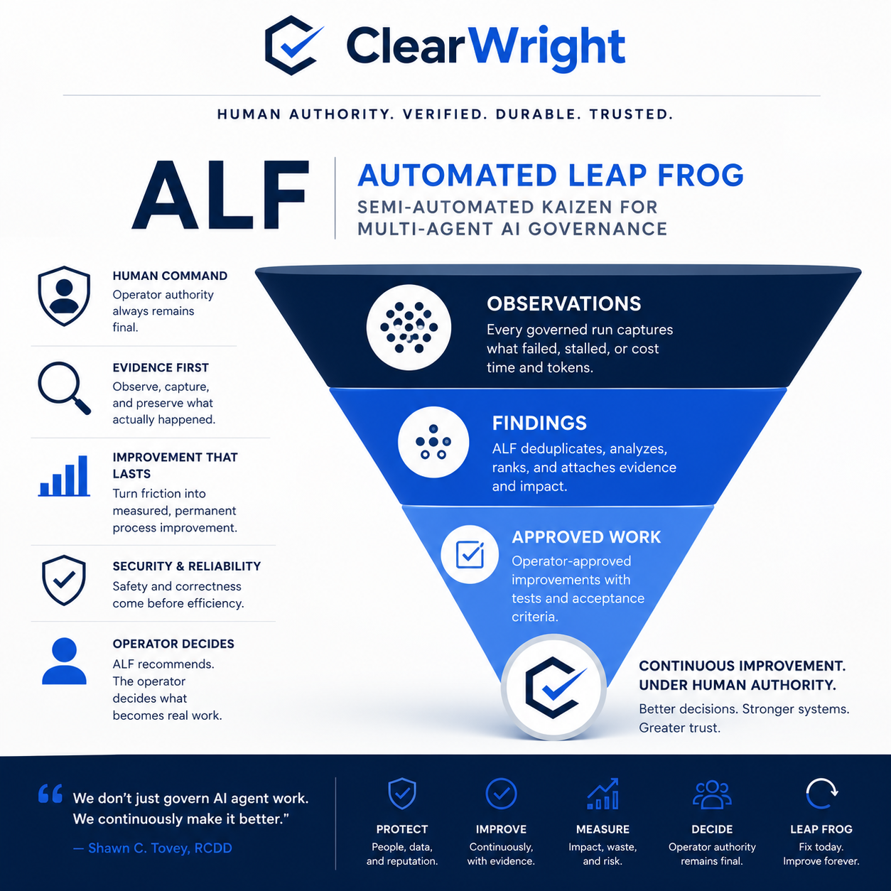

# ALF (Automated Leapfrog) - vision

> **Planned capability (vision). ALF Phase 1 is planning only and has not
> shipped.** This page shows the intended end-state of ALF, not current
> behavior. No ALF implementation code exists yet, and the Phase 1 plan gate
> has not been reached. See [ROADMAP.md](../../ROADMAP.md) and
> [DECISIONS.md](../DECISIONS.md) (decision D-15).

*The graphic above depicts the intended end-state. Any present-tense wording
inside the image describes the design goal, not a running system.*

## What ALF is intended to become

ALF (Automated Leapfrog) is the planned self-improvement track for ClearWright.
As designed, it will:

- observe how governed runs succeed, fail, stall, retry, and consume resources,
  and preserve those observations as immutable evidence;
- synthesize deduplicated, evidence-bound improvement findings, rank them under
  a transparent versioned priority model, and attach impact and blast-radius;
- propose testable governed-work specifications for the operator to review.

The operator alone would decide which findings become real work. As planned,
ALF will not create authority, will not create governed work items on its own,
and will not begin implementation without operator approval and the normal
ClearWright governed workflow.

## Status

Phase 1 is in planning. The plan gate has not been reached, and no
implementation code exists. ALF is the concrete self-improvement vehicle
intended to feed Project Leapfrog; it does not add a new project phase. See
[ROADMAP.md](../../ROADMAP.md) for the current roadmap and
[DECISIONS.md](../DECISIONS.md) (D-15) for the governing decision.
